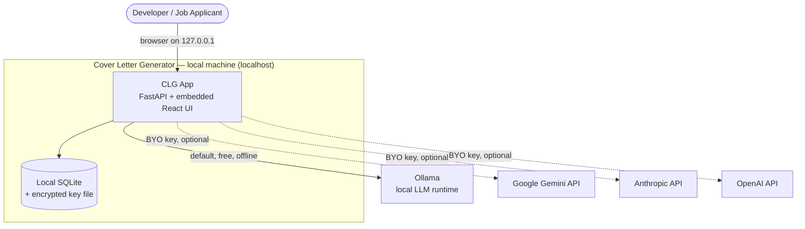
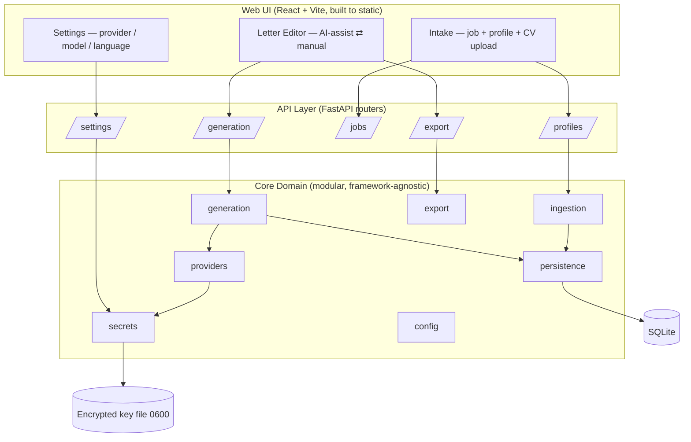
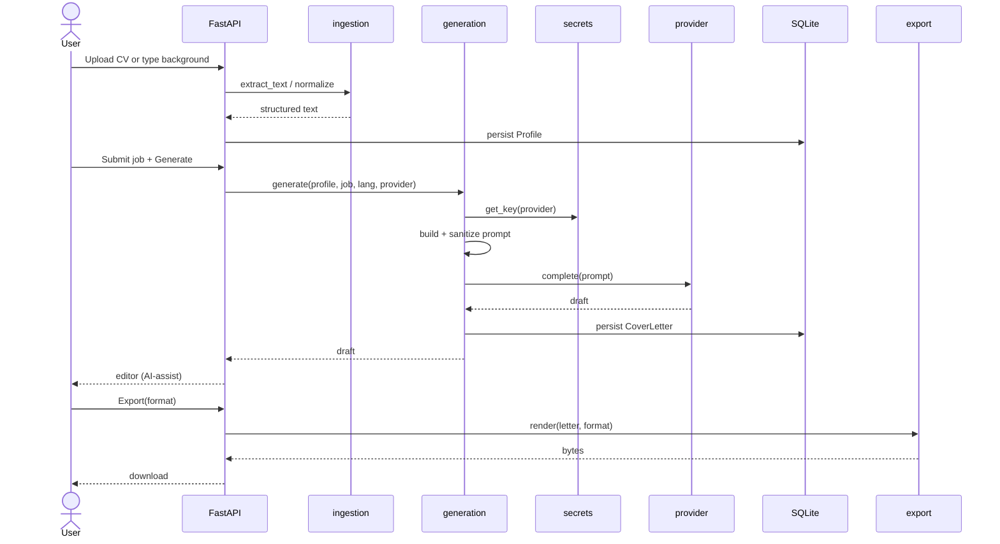
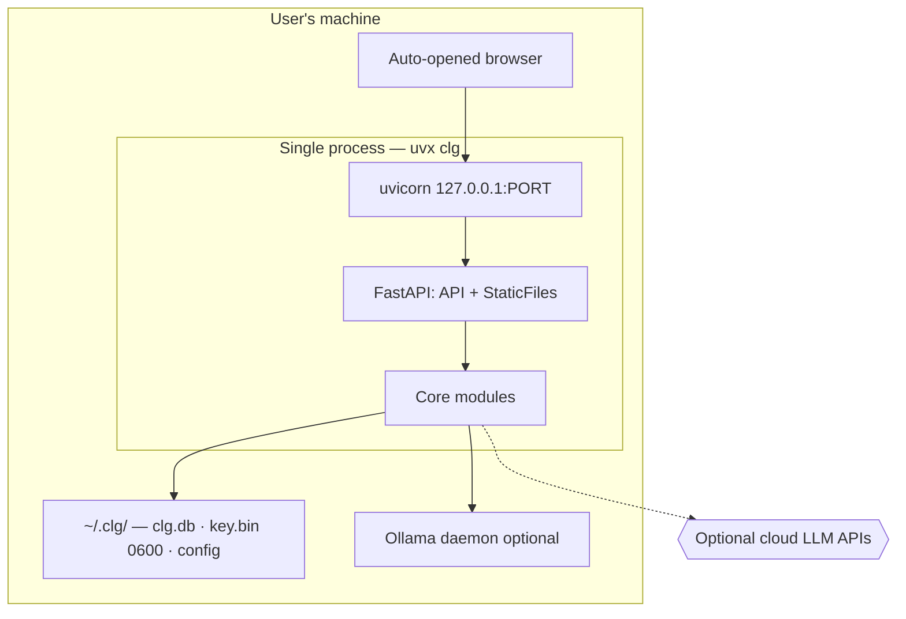
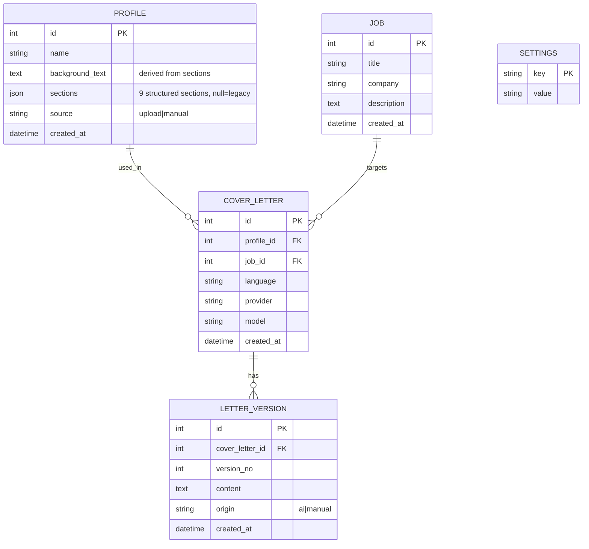
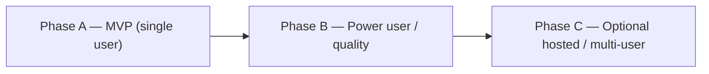
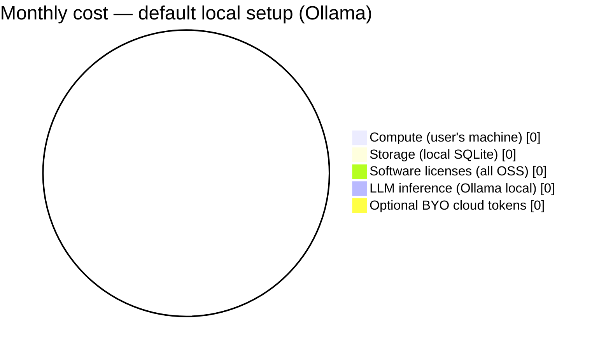

# Cover Letter Generator (CLG) — Architecture Plan

> **Status:** Approved for implementation · **Date:** 2026-05-30 · **Owner:** Vitor

## Executive Summary

CLG is a **local-first, open-source** application that helps developers craft
personalized cover letters for international tech roles. It runs entirely on the
user's machine: a single Python process (FastAPI) serves a JSON API and an
embedded React UI on `127.0.0.1`, persists to SQLite, and orchestrates large
language models through a **pluggable provider abstraction** — Ollama by default
(free, offline) with optional bring-your-own-key Gemini / Anthropic / OpenAI.
The architecture is a **modular monolith** with a framework-agnostic domain core.
v1 ships the full feature set: CV upload (PDF/DOCX) with local parsing, manual
background entry, AI-assisted ⇄ manual editing, multi-language output, and export
to PDF, HTML, Markdown, TXT, and DOCX.

## Discovery Summary

| Dimension | Finding |
|-----------|---------|
| Problem | Reduce friction for devs applying to international jobs; surface editable structure, not a black box |
| Users | Individual developers, technical, privacy-conscious; single user per install |
| Business model | Open source, 100% free, no paid services in the stack |
| Scale | One user per machine; no concurrency or multi-tenant requirement at v1 |
| Compliance | None (no data leaves the machine by default); privacy-by-default is a product value, not a regulation |
| Team | Solo / small; Python-comfortable; prefers debate-then-design workflow |
| Budget | $0 infrastructure; only optional user-owned cloud token spend |
| Reference system | `linkedin-post-executor` — source of the provider-abstraction + encrypted-key pattern |

**Constraints (non-negotiable):** 100% OSS & free · BYO key + local AI (Ollama
default) · English-first, multi-language · mobile-first responsive UI · modular
architecture · README as the public face.

**Locked scope decisions (2026-05-30):** v1 = **all features**; CV ingestion =
**local parse + manual** (no LLM extraction, see ADR-004); exports = **all five**.

## Architecture Style

**Chosen: Modular Monolith** (see [ADR-002](./architecture/ADR-002-modular-monolith.md)).

| Style | Fit for CLG | Verdict |
|-------|-------------|---------|
| Modular Monolith | Single local process, clear inner module boundaries, future-split-friendly | ✅ Chosen |
| Plain Monolith | Simpler but fails maintainability/extensibility requirement | Rejected |
| Microservices / Serverless | Massive operational overhead for a single-user local tool | Rejected |

Dependency rule: **UI → API → Core → (DB / key file)**. The core imports no web
framework; routers are thin adapters.

## Technology Stack

| Layer | Primary | Alternative | Notes |
|-------|---------|-------------|-------|
| UI | React 19 + Vite (TypeScript), built to static | SvelteKit static | Served by FastAPI `StaticFiles`; mobile-first |
| API / server | FastAPI + uvicorn | Litestar | ASGI; serves API + built UI on localhost |
| Domain core | Plain Python modules + Pydantic models | — | Framework-agnostic |
| Persistence | SQLite via SQLModel (SQLAlchemy core) | raw `sqlite3` | Single file at `~/.clg/clg.db`; repository pattern keeps DB swappable |
| AI providers | `ollama`, `google-genai`, `anthropic`, `openai` SDKs behind `LLMProvider` | LiteLLM (deferred) | Selected by `CLG_AI_PROVIDER` (ADR-003) |
| CV parsing | `pypdf`, `python-docx` | `pdfplumber` | Local, deterministic (ADR-004) |
| Export | `python-docx` (DOCX), `weasyprint` (PDF), `markdown`/Jinja2 (HTML/MD/TXT) | `reportlab` for PDF | All 5 formats in-process |
| Secrets | `cryptography` AES-256-GCM, `0600` key file | OS keychain (Phase B) | Outside repo (ADR-005) |
| Config | `pydantic-settings`, `CLG_` env prefix | — | Env + Settings UI overrides |
| Packaging / dist | `uv` / `uvx clg` | pipx | One-command launch; opens browser |
| Tests | `pytest` + `httpx` (API), Vitest + RTL (UI) | — | Fake provider for deterministic LLM tests |

### Evaluation matrix (key choices)

| Criterion (weight) | Python local-first | Go single-binary (rejected) |
|--------------------|:------------------:|:---------------------------:|
| Team fit (H) | ★★★★★ | ★★★☆☆ |
| Parsing/LLM ecosystem (H) | ★★★★★ | ★★☆☆☆ |
| Distribution simplicity (M) | ★★★☆☆ (`uvx`) | ★★★★★ (single binary) |
| Privacy/offline (H) | ★★★★★ | ★★★★★ |
| Cost (M) | ★★★★★ ($0) | ★★★★★ ($0) |

## System Architecture

> Interactive viewer: [clg-architecture-diagrams.html](./clg-architecture-diagrams.html) ·
> Editable: [clg-architecture.drawio](./clg-architecture.drawio) ·
> Sources: [`docs/diagrams/`](./diagrams/)

### System Context

### Component / Container

### Data Flow (generation + export)

### Deployment

### Data Model (ER)

> Secrets are **not** in the DB — they live in the encrypted key file (ADR-005).

## Scalability Roadmap

- **Phase A — MVP (now):** sync generation, single SQLite file, all 5 exports
  in-process, React served by FastAPI. Goal: validate the full local flow.
  *Scaling hooks to build in from day one:* repository pattern (DB-swappable),
  provider registry, settings abstraction.
- **Phase B — Power user / quality:** streamed token output (SSE), background
  jobs for long generations, letter versioning + diff UI, prompt/tone template
  library, provider auto-fallback (Ollama → cloud), optional OCR for scanned
  PDFs, OS-keychain secret storage. *Why:* better UX and robustness; no infra
  change. *Migration:* additive — no schema break beyond version history.
- **Phase C — Optional hosted / multi-user (only if demanded):** Postgres
  adapter behind the repository interface, per-user auth + data isolation,
  server-side key vault, worker queue for generation/export. *Why:* only if the
  project pivots to a hosted offering. *Migration:* swap persistence + secrets
  adapters; core domain unchanged (the payoff of the modular monolith).

## Cost Analysis

| Component | MVP (Ollama) | With BYO cloud |
|-----------|:------------:|:--------------:|
| Compute | $0 (local) | $0 (local) |
| Storage | $0 (SQLite) | $0 |
| Licenses | $0 (OSS) | $0 |
| LLM inference | $0 (Ollama) | pay-per-use, user-owned |
| **Total to the project** | **$0** | **$0** (user pays own tokens) |

The only non-zero cost is **optional**, **user-owned**, and **pay-per-use** cloud
tokens. The free path (Ollama) is fully $0. This honors the "100% free" principle.

## Best Practices & Patterns

- **Repository pattern** for persistence → DB-swappable (SQLite → Postgres).
- **Strategy/registry** for providers → add a provider without touching
  orchestration.
- **Dependency direction inward** (core has no web/UI imports); enforce with an
  import linter in CI.
- **DTO boundary** (Pydantic) between API and core; never leak ORM rows to the UI.
- **Prompt templating** isolated in `generation` with explicit
  English-first + language-override handling.
- **Anti-patterns to avoid:** LLM logic in routers; secrets in the DB; UI
  framework leaking into core; premature hosted-mode complexity.

## Security Architecture

Threat surface is dominated by **LLM prompt injection** (OWASP LLM Top 10) since
user-controlled CV text and job descriptions feed prompts, plus **local secret
handling**.

- **SEC — Prompt injection:** treat CV/job text as untrusted data; wrap in
  delimited, clearly-labeled sections; instruct the model to ignore embedded
  instructions; never let generated/ingested text reach a shell, file path, or
  eval. No tool-use/function-calling in v1 generation.
- **SEC — Secrets:** AES-256-GCM encrypted key file, `0600`, outside repo,
  decrypt in-memory only at call time (ADR-005). Never log keys.
- **SEC — Local server exposure:** bind to `127.0.0.1` only; CORS locked to the
  local origin; no `0.0.0.0`.
- **SEC — File upload:** validate type/size; parse with hardened libs; cap
  extraction size; reject macros/active content in DOCX.
- **SEC — Supply chain:** pin dependencies; OSS-only; periodic vulnerability
  scan (the repo's `se-security-reviewer` agent + `security-review` skill).
- **SEC — Privacy:** no telemetry; nothing leaves the machine unless the user
  explicitly chooses a cloud provider.

## Risks & Mitigations

| Risk | Impact | Mitigation |
|------|--------|------------|
| Prompt injection via CV/job text | Bad/abusive output | Delimited untrusted sections, no tool use, output review in editor |
| Poorly structured / scanned PDFs | Empty/garbled extraction | Always-editable extracted text; low-confidence UI warning; OCR deferred |
| `weasyprint` system deps (cairo/pango) | Install friction for PDF | Document deps; fall back to `reportlab` if friction is high |
| Provider API drift (SDK breaks) | Generation fails | Thin adapter per provider; fake provider in tests; pin SDK versions |
| Local key file readable by other local users | Key leakage | `0600` perms; document OS-keychain upgrade (Phase B) |
| Scope creep from "all features in v1" | Slow MVP | Phased task plan in `/plan/`; export + provider modules built behind stable interfaces |

## Architecture Decision Records

- [ADR-001 — Python, local-first](./architecture/ADR-001-python-local-first.md)
- [ADR-002 — Modular monolith](./architecture/ADR-002-modular-monolith.md)
- [ADR-003 — Pluggable provider abstraction](./architecture/ADR-003-provider-abstraction.md)
- [ADR-004 — Local CV parsing](./architecture/ADR-004-local-cv-parsing.md)
- [ADR-005 — Encrypted secret storage](./architecture/ADR-005-secret-storage.md)

## Status

**MVP delivered (2026-05-30).** All 8 phases / 41 tasks of
[`/plan/architecture-clg-mvp-1.md`](../plan/architecture-clg-mvp-1.md) are complete
and verified (ruff, mypy --strict, import-linter, pytest, Vitest, production build).
See the [README](../README.md) for setup and run instructions.

### Deferred to Phase B (post-MVP)

- Persist manual editor edits (a manual `LetterVersion` endpoint); today the editor's
  manual mode is client-side and exports use the latest AI version.
- Token streaming (SSE) and background jobs for long generations.
- OCR for scanned/image PDFs.
- OS-keychain secret storage (currently AES-256-GCM file per ADR-005).
- `reportlab` fallback for PDF where WeasyPrint native libs are unavailable.
